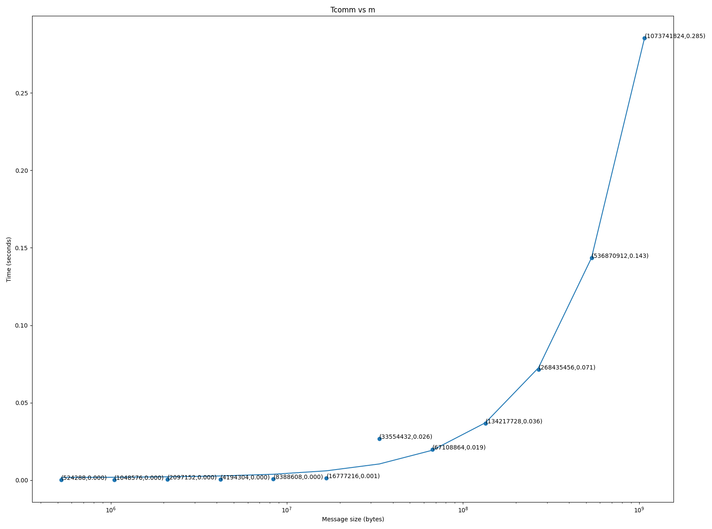

# Assignment 1

My answers to the questions are in this file.

The assignment writeup is programming_assignment_1.pdf.

## Building

There is a Makefile in this directory that tars up the contents to create the submission tar.gz.

Each section of the project has its own Makefile and job script. The folders also contain the output from the job on ISAAC-NG. Question 1 Part 2 has two of the output files. Both work only difference between them is that the .osecond didn't have the MPI_Barrier call before the loop while the .othird did. This change didn't really make much of a difference so I just left both of them.

# Problems

1. Question 1.

    1. Part 1: Code and output located at `./part1/1`. All processes use their own rank as their unique integer.
    1. Part 2: Code and output located at `./part1/2`.
        * graph.py will generate an image based off of job.othird. (This file is stored as Tcommvsm.png)
        * My program sends sizes 1 MiB to 1 Gib in powers of two. It does this 100 times. The graphing program averages the times at each data size and plots them as a scatter plot. It then calculates the line of best fit, graphs it, and prints the value of MU, TAU, and the estimated transfer rate(ETR) (derived from MU).
        * For the data in job.othird the values are:
            * MU  = `2.6421704014268854e-10` seconds per byte
            * TAU = `0.0016340827161799474` seconds
            * ETR = `3784767248.3953233` Bytes per second or `3.5248391780958728` GiB/s (`28.198713424766982` Gib/s)
1. Question 2.
    * Code and output located at `./part2`. All processes use their rank+1 as their unique integer. This is to keep the multiplicationg from being 0.

