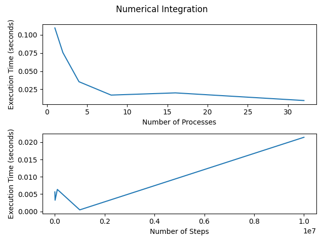

# Assignment 2

## Part 1

Located at `./part1`. Job scripts are located in `./part1/scripts` and all job results are in `./part1/jobresults`

## Part 2

Located at `./part2`. Job scripts are located in `./part2/scripts` and all jobresults are in `./part2/jobresults`.
The code used to generate the graph is located at `./part2/graph.py`.

Folder names that start with p designate part of the question. The name having a number then p means that many processors (1p is 1 processor). Name being just number is n in the equation 10^n (folder 3 contains stuff for nsteps = 10^3).

