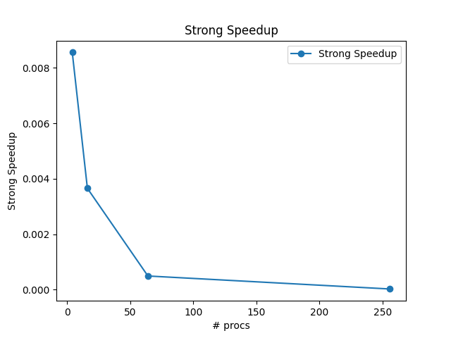

# Assignment 3

## Part 1

Contains serial computation code

## Part 2

Contains the parallel computation code

## Part 3

Contains graphing code

Strong speedup goes down with more processes which I assume is because n is not very big so the communication time is having a very large effect on the runtime.

* strong_speedup.png is the strong speedup.

